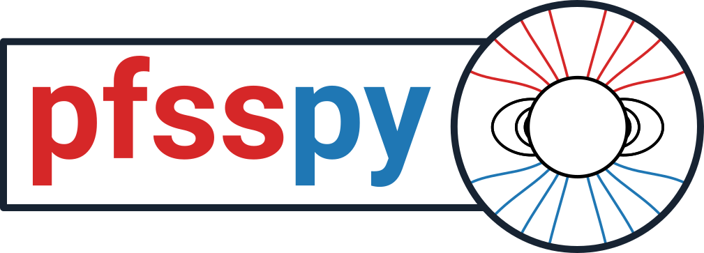

From David Stansby, the lead author of *pfsspy*:

*pfsspy* has been archived, and is no longer developed -
I no longer work in Solar Physics,
and do not have time to maintain or support the package.
*pfsspy* will probably continue working in the short term, but
incompatibilities with dependencies will appear some point.
The beauty of open source is that someone (maybe you!) can fork the code,
and maintain, update, and improve it. If you do, I'd be greatful if you
chose a new name for it and acknowledged the heritage of *pfsspy* in
the new package.

Thanks to everyone who has contributed, whether through code or otherwise -
this was a large part of my professional identity at the time, and I'm
proud of the science it helped enable 😊

Potential Field Source Surface model package for Python. This package is based on original code by Anthony Yeates, which can be found at https://github.com/antyeates1983/pfss.

Documentation
-------------
Full documentation for the package can be found at https://pfsspy.readthedocs.io

Code of conduct
---------------
This is a community package, which has adopted the SunPy code of conduct. Please follow the [code of conduct](CODE_OF_CONDUCT.md) when interacting with others within the pfsspy community.

Contributing
------------
`pfsspy` is **not** accepting new features, as it is considered feature complete. Issues reporting bugs, and pull requests fixing bugs, improving performance, or improving documentation are welcome and encouraged.
